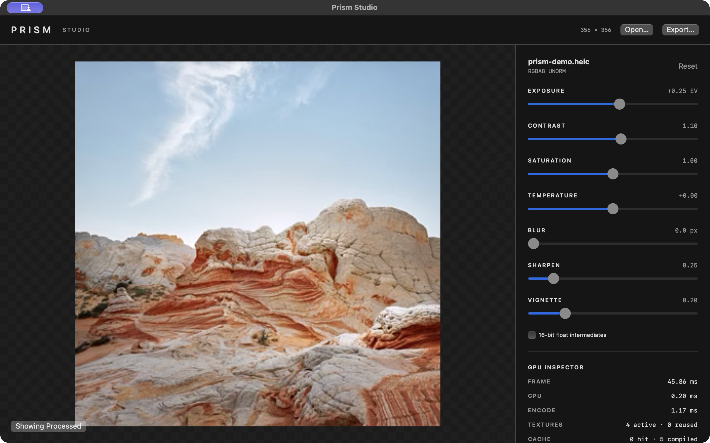
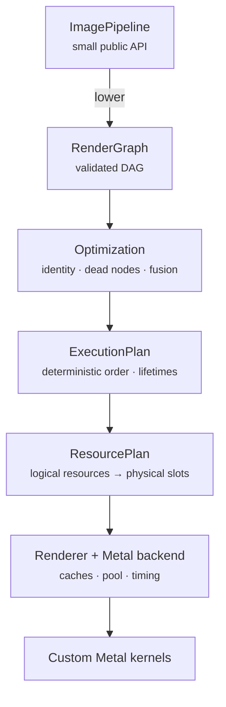
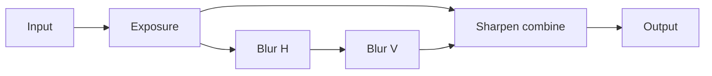

# PRISM

> GPU-accelerated image processing for Swift  
> **Torin Etheridge · October 6, 2026**

[](https://github.com/torinriley/Prism/actions/workflows/ci.yml?query=branch%3Amain)

[Architecture](Documentation/ARCHITECTURE.md) · [Render graph](Documentation/RENDER_GRAPH.md) · [Metal backend](Documentation/METAL_BACKEND.md) · [Color](Documentation/COLOR.md) · [Benchmarks](Documentation/BENCHMARKING.md) · [Optimization log](Documentation/OPTIMIZATION.md) · [Project status](Documentation/STATUS.md)

Prism is a Swift and Metal image-processing engine for Apple platforms. A compact value-oriented API hides an explicit render graph, deterministic scheduling, graph optimization, resource lifetime analysis, pooled textures, pipeline and LUT caches, asynchronous GPU execution, and instrumentation. Core Image is not used to implement effects.



*The screenshot is the first frame after loading an image, so the inspector shows cold-start cost (pipelines compiling, no texture reuse yet). Subsequent frames are much cheaper; see the measurements below.*

```swift
import Prism

let pipeline = ImagePipeline {
    Exposure(0.25)
    Contrast(1.1)
    GaussianBlur(radius: 6)
}

let output = try await pipeline.render(inputCGImage)
```

## Requirements and installation

- Swift 6 language mode. Built and tested only with Xcode 27 / Swift 6.4; older toolchains have not been tried
- macOS 14+, iOS 17+. The `Prism` library compiles for iOS devices and the iOS Simulator; the tests, benchmarks and all measurements have been run on macOS only (Apple M5). Prism Studio is macOS-only.
- A Metal-capable device
- Apple's Metal Toolchain component (`xcodebuild -downloadComponent MetalToolchain`) if the local Xcode installation does not include the `metal` compiler
- Shaders are compiled at build time where the build system supports Metal (Xcode, Swift 6.4's SwiftPM). With an older SwiftPM build system the `.metal` files are only copied, and Prism compiles them from source when the first `Renderer` is created (`swift build`, `swift test` and `swift run` all work either way)

Add this repository as a Swift Package dependency and link the `Prism` product:

```swift
.package(url: "https://github.com/torinriley/Prism.git", branch: "main")
```

For a local checkout:

```swift
.package(path: "../Prism")
```

```swift
.target(name: "YourApp", dependencies: [.product(name: "Prism", package: "Prism")])
```

## API

Pipelines are reusable `Sendable` values. A `Renderer` owns caches and pooled resources and is safe to share across concurrent tasks.

```swift
let renderer = try Renderer(instrumentation: .standard)

async let first = pipeline.render(imageA, using: renderer)
async let second = pipeline.render(imageB, precision: .high, using: renderer)
let (a, b) = try await (first, second)
```

Use `.high` for `rgba16Float` intermediate storage. Arithmetic is float32 in both modes. High precision reduces banding and accumulated quantization but doubles texture memory; it does not imply HDR or professional wide-color correctness.

Existing Metal textures can enter and leave without a CPU round trip:

```swift
let outputTexture = try await pipeline.render(inputTexture, using: renderer)
let result = try await pipeline.renderWithMetrics(inputTexture, using: renderer)
```

The caller must finish producing an input texture before rendering begins. Prism does not insert cross-queue synchronization for external command queues.

## Operations

| Category | Operations |
|---|---|
| Color | `Exposure`, `Contrast`, `Saturation`, `Temperature` |
| Spatial | separable `GaussianBlur`, unsharp-mask `Sharpen`, bilinear `Resize` |
| Effects | `Vignette` |
| Color grading | `LUT3D`, `.cube` parsing, trilinear `LUTGrade` |

Neutral parameters are true identities. The optimizer removes them before execution.

## Architecture



Sharpen demonstrates a real branch: its combine node reads both the original and the separably blurred image. The graph validates dependencies, cycles, dimensions and formats before resource allocation. Planning computes final use, so a ten-pass chain requires an input and two alternating intermediates, not one allocation per pass. See [ARCHITECTURE.md](Documentation/ARCHITECTURE.md), [RENDER_GRAPH.md](Documentation/RENDER_GRAPH.md), and [METAL_BACKEND.md](Documentation/METAL_BACKEND.md).



## Instrumentation

```swift
let renderer = try Renderer(instrumentation: .detailed)
let result = try await pipeline.renderWithMetrics(image, using: renderer)
print(result.metrics)
```

Metrics include total, import, CPU encode, GPU and export durations; per-pass GPU durations; texture allocations and reuses; peak resources; pipeline-cache behavior; and eliminated passes. `.standard` uses the production encoding path. `.detailed` uses one encoder per pass to obtain boundary timestamps and is intended for inspection, not default-path benchmarking. Instruments signposts use subsystem `dev.prism`.

## Performance methodology and results

The `prism-bench` release executable records the machine, OS, build, thermal state, input, iteration count and full timing distributions. Inputs are deterministic synthetic images unless `--image` is provided. No result below is fabricated or projected.

```sh
swift run -c release prism-bench --suite all
```

Selected measured medians on one Apple M5, macOS 27.0.1, release build:

| Case | Resolution | Result |
|---|---:|---:|
| Exposure, original CGImage path | 4K | 16.8 ms end to end |
| Exposure, optimized CGImage path | 4K | 4.6 ms end to end |
| 5-stage pipeline, texture path, 8-bit | 4K | 2.8–3.1 ms total (two runs); 3.5 ms in float16 |
| Gaussian blur σ=8, before tiled/register-blocked kernel | 4K | 7.70 ms GPU |
| Gaussian blur σ=8, optimized | 4K | 3.30 ms GPU |
| LUT encode before cache | — | 0.42–0.47 ms |
| LUT encode after cache | — | 0.02–0.04 ms |

Measurements come from the committed result files in `Benchmarks/results/`; they vary with GPU state. The complete methodology and caveats are in [BENCHMARKING.md](Documentation/BENCHMARKING.md), and the profile → change → remeasure history is in [OPTIMIZATION.md](Documentation/OPTIMIZATION.md).

## Correctness

`swift test` currently runs **182 tests in 22 suites**. Coverage includes Double-precision CPU references for every operation; tiny, odd, large, transparent and boundary-heavy images; both precision modes; random graph/resource properties; concurrent rendering and contention; cancellation; and direct-vs-optimized equivalence. Thread Sanitizer and Address Sanitizer have run clean. Important tests were also mutation-checked by deliberately breaking their invariants and confirming they fail.

## Prism Studio

The macOS demo is intentionally small: it exists to exercise and inspect the engine.

```sh
swift run PrismStudio
```

It supports drag-and-drop/Open, debounced real-time controls, press/hover before-and-after, 8-bit or half-float rendering, PNG export, and a live GPU inspector showing the executed graph, per-pass timings, texture reuse and pipeline-cache activity.

Two things to know when reading its numbers and output: Studio renders at `.detailed` instrumentation, which encodes each pass separately so it can be timed, so its GPU totals are not those of the default encoding; and with the half-float toggle on, PNG export writes a 16-bit file (see [Studio notes](Examples/PrismStudio/README.md#notes-and-known-issues)).

The app is a profiling surface, not a photo-editor product. Its implementation is documented in [Examples/PrismStudio](Examples/PrismStudio/README.md).

## Color and precision

Standard processing is premultiplied, sRGB-encoded `rgba8Unorm`. High precision is premultiplied, extended-sRGB `rgba16Float`; it preserves finer source values and out-of-range values through spatial operations, while current color operations clamp to [0, 1]. Prism does not claim HDR, wide-gamut or ICC-managed professional output. See [COLOR.md](Documentation/COLOR.md) for the exact per-operation contract.

## Limitations

- `CGImage` and `MTLTexture` are the supported interop types; URL/Data/CIImage conveniences are not part of the current public surface.
- Bilinear resize has no downsampling prefilter.
- There is no public composite operation yet, although the internal graph is multi-input.
- Peak memory scales with renders in flight; Prism does not impose an in-flight limit.
- Tiled blur reports unsupported threadgroup configurations instead of silently falling back.
- Performance data currently covers one Apple GPU generation.

Prism has no third-party runtime dependencies.

## License

Prism is released under the [Apache License 2.0](LICENSE). Copyright 2026 Torin Etheridge; see [NOTICE](NOTICE).
